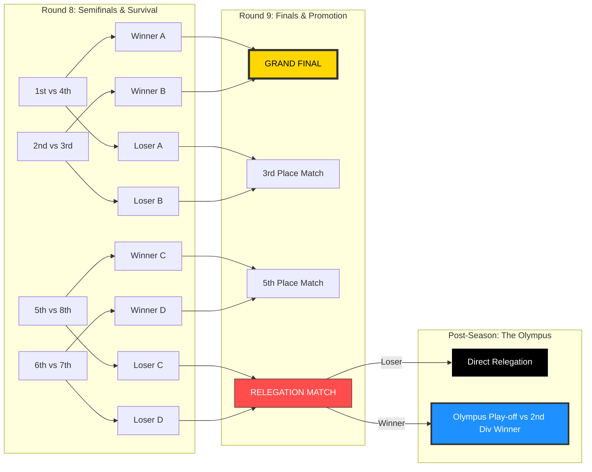

# ⚔️ Tournament Flow: Rounds 8 & 9 (The Coliseum)

This document describes the business logic and visual flow for the post-season phase. The system splits the league into two distinct brackets based on the final standings of Round 7.

## 📊 Tournament Visualization

## 🛠️ Logic Implementation

### 1. Match Identification

To render these brackets, the frontend queries the matches table filtering by match_group. The application maps the match_tag field to the corresponding UI slot:

| Match Group | Match Tag           | Description                           | Round |
| ----------- | ------------------- | ------------------------------------- | ----- |
| `top_4`     | `semi_1`            | 1st Place vs 4th Place Semifinal      | 8     |
| `top_4`     | `semi_2`            | 2nd Place vs 3rd Place Semifinal      | 8     |
| `top_4`     | `grand_final`       | Championship match (Winners of Semis) | 9     |
| `top_4`     | `third_place`       | 3rd Place match (Losers of Semis)     | 9     |
| `bottom_4`  | `survival_1`        | 5th Place vs 8th Place Match          | 8     |
| `bottom_4`  | `survival_2`        | 6th Place vs 7th Place Match          | 8     |
| `bottom_4`  | `relegation_final`  | The battle to avoid the Olympus       | 9     |
| `olympus`   | `promotion_playoff` | 1st Div Survivor vs 2nd Div Champion  | 10    |

### 2. Transition from Projected to Official

**Projected State (J1-J7):** The UI uses the position field from the league_rankings view to fill the brackets with tentative names. This allows spectators to see "who would play against whom" in real-time.

**Official State (J8+):** Once the Admin generates the Play-off matches in the database, the UI switches from "Rankings-based" to "Match-based" rendering. It will now consume fixed home_trainer_id and away_trainer_id from the matches table.

### 3. The Olympus Play-off

This is a unique cross-league event that serves as the season's grand finale.

- It is identified by `match_group: 'olympus'`.
- It typically lacks a `league_id` (or it is null) because it involves players from two different tiers.
- **Narrative Impact:** The UI should render this match with a distinct "Premium" style to signify its importance as the bridge between divisions.
